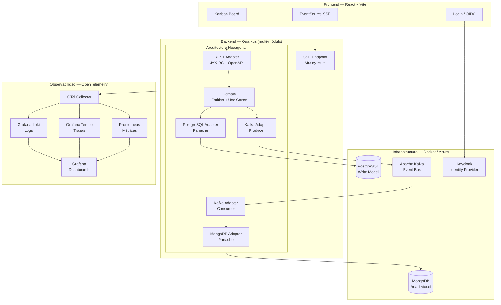
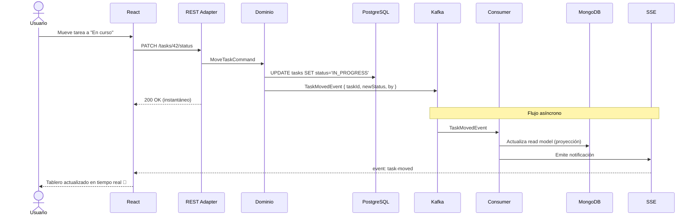

# Episodio 00 — Bienvenida y Arquitectura del Proyecto

> **QuarkStack: Full-Stack con Quarkus + React — de cero a la nube**
> Serie completa • Código abierto • Gratis en YouTube

---

## 🎯 ¿De qué trata este curso?

Este curso nació de una pregunta muy concreta: **¿cómo se ve una aplicación Quarkus real, completa, sin atajos?**

No un "Hello World". No un CRUD básico. Una aplicación que combine:

- Arquitectura Hexagonal real con Maven multi-módulo
- CQRS y Event-Driven Architecture
- Mensajería asíncrona con Kafka
- Programación reactiva con Mutiny
- Bases de datos relacionales *y* NoSQL
- Seguridad con OIDC
- Observabilidad de verdad
- Pruebas unitarias e integración
- Frontend funcional en React
- Despliegue real en Azure

Todo construido sobre **un solo repositorio**, de forma incremental, episodio a episodio.

> ⚠️ **Este curso no es para principiantes en Java.** Se asume conocimiento de Java, Jakarta EE y conceptos básicos de microservicios. Lo que *no* necesitas saber es React — lo aprenderemos juntos desde cero.

---

## 🏗️ El Proyecto: QuarkStack

**QuarkStack** es un sistema de gestión de tareas colaborativo en tiempo real, estilo Jira simplificado.

Lo elegimos porque:

- Tiene suficiente complejidad de dominio para justificar todos los patrones
- Es visualmente atractivo (tablero Kanban en React)
- Justifica naturalmente CQRS, EDA, arquitectura hexagonal y reactividad
- Necesita tanto base de datos relacional como NoSQL
- Las notificaciones en tiempo real hacen el demo irresistible 😄

### ¿Cómo se ve QuarkStack?

```
┌─────────────────────────────────────────────────────────────────┐
│  QuarkStack                              👤 Diego Villanueva ▾  │
├──────────────┬──────────────┬───────────────────────────────────┤
│  📋 Backlog  │  🔄 En curso │  ✅ Terminado                     │
│              │              │                                    │
│  ┌─────────┐ │  ┌─────────┐ │  ┌─────────┐                     │
│  │Tarea #4 │ │  │Tarea #1 │ │  │Tarea #2 │                     │
│  │API REST │ │  │Login UI │ │  │DB Setup │                     │
│  │🏷️ backend│ │  │🏷️ front │ │  │🏷️ infra │                     │
│  └─────────┘ │  └─────────┘ │  └─────────┘                     │
│              │              │                                    │
│  ┌─────────┐ │              │                                    │
│  │Tarea #5 │ │              │                                    │
│  │Kafka EDA│ │              │                                    │
│  │🏷️ backend│ │              │                                    │
│  └─────────┘ │              │                                    │
└──────────────┴──────────────┴───────────────────────────────────┘
  🔔 Tarea #1 fue movida a "En curso" por Ana García — hace 3 seg
```

---

## 🏛️ Arquitectura del Sistema

### Vista general



### Flujo CQRS en acción



---

## 📦 Stack Tecnológico

### Backend

| Tecnología                                      | Uso en el proyecto                             |
|-------------------------------------------------|------------------------------------------------|
| **Quarkus 3.x**                                 | Framework principal                            |
| **Jakarta EE** (JAX-RS, CDI, Bean Validation)   | REST, inyección, validaciones                  |
| **MicroProfile** (OpenAPI, Health, Config, JWT) | Documentación, salud, configuración, seguridad |
| **Hibernate ORM + Panache**                     | Persistencia relacional, Repository pattern    |
| **Panache MongoDB**                             | Persistencia de documentos, read models        |
| **SmallRye Reactive Messaging**                 | Integración con Kafka, EDA                     |
| **Mutiny**                                      | Programación reactiva (`Uni`, `Multi`)         |
| **RESTEasy Reactive**                           | Endpoints no bloqueantes                       |
| **SmallRye JWT / OIDC**                         | Autenticación y autorización                   |
| **Flyway**                                      | Migraciones de base de datos                   |
| **OpenTelemetry**                               | Trazas, métricas, logs exportados vía OTLP     |

### Frontend

| Tecnología          | Uso en el proyecto                        |
|---------------------|-------------------------------------------|
| **React 19**        | Framework UI                              |
| **Vite**            | Build tool y dev server                   |
| **Tailwind CSS**    | Estilos utilitarios                       |
| **React Router v6** | Ruteo de la SPA                           |
| **TanStack Query**  | Fetching, cache y sincronización de datos |
| **oidc-client-ts**  | Integración OIDC con Keycloak             |

### Infraestructura (Docker local / Azure)

| Local (Docker) | Azure                                  | Rol                      |
|----------------|----------------------------------------|--------------------------|
| PostgreSQL     | Azure Database for PostgreSQL Flexible | Base de datos relacional |
| MongoDB        | Azure Cosmos DB (API MongoDB)          | Base de datos documental |
| Apache Kafka   | Azure Event Hubs (API Kafka)           | Bus de eventos           |
| Keycloak       | Microsoft Entra External ID            | Identity Provider        |
| —              | Azure Container Apps                   | Runtime de contenedores  |
| —              | Azure Static Web Apps                  | Hosting del frontend     |
| —              | Azure Container Registry               | Registro de imágenes     |

### Observabilidad

| Herramienta                 | Rol                          |
|-----------------------------|------------------------------|
| **OpenTelemetry Collector** | Receptor y enrutador central |
| **Prometheus**              | Métricas                     |
| **Grafana Tempo**           | Trazas distribuidas          |
| **Grafana Loki**            | Logs centralizados           |
| **Grafana**                 | Dashboards unificados        |

---

## 🗂️ Estructura del Repositorio

El árbol completo de archivos del proyecto, con el episodio en que se crea cada uno, está en:

📄 **[docs/ESTRUCTURA.md](../ESTRUCTURA.md)**

---

## ✅ Prerrequisitos

### Conocimiento

- ✅ Java 17+ (el curso usa Java 21)
- ✅ Conceptos de Jakarta EE (CDI, JAX-RS, JPA)
- ✅ Conceptos básicos de microservicios y REST
- ✅ Git y GitHub
- ⬜ React — **lo aprenderemos desde cero en el Bloque 2**
- ⬜ Kafka — lo explicamos desde los fundamentos
- ⬜ Azure — se asume cuenta nueva (con créditos gratuitos)

### Herramientas

Estas herramientas las instalaremos en el **Episodio 01**:

```
✦ JDK 21 (recomendado: Eclipse Temurin)
✦ Maven Wrapper (incluido en el proyecto)
✦ Quarkus CLI
✦ Node 24 LTS + npm
✦ Docker Desktop
✦ Git
✦ IDE: IntelliJ IDEA / VS Code (con extensiones Java y React)
✦ Azure CLI (para los episodios de despliegue)
✦ Cuenta de Azure (créditos gratuitos de $200 para cuentas nuevas)
```

---

## 📚 Índice Completo del Curso

### 🧱 Bloque 0 — Fundamentos y Setup
| #  | Episodio                               | Estado       |
|----|----------------------------------------|--------------|
| 00 | Bienvenida y arquitectura del proyecto | ✅ Estás aquí |
| 01 | Setup del entorno completo             | 🔜 Siguiente |

### 🏗️ Bloque 1 — Arquitectura Hexagonal con Quarkus
| #  | Episodio                                                     |
|----|--------------------------------------------------------------|
| 02 | Arquitectura Hexagonal: puertos, adaptadores y módulos Maven |
| 03 | El dominio: entidades, value objects y casos de uso          |
| 04 | Adaptador REST: JAX-RS, OpenAPI y validaciones               |
| 05 | Adaptador de Persistencia: PostgreSQL con Panache            |

### ⚛️ Bloque 2 — React desde cero (para Java devs)
| #  | Episodio                                       |
|----|------------------------------------------------|
| 06 | React para Java devs: componentes, props y JSX |
| 07 | Estado y efectos: `useState`, `useEffect`      |
| 08 | Ruteo y layout: React Router + Tailwind CSS    |
| 09 | Consumo de la API REST desde React             |
| 10 | El tablero Kanban: primer componente complejo  |

### 🗄️ Bloque 3 — Persistencia Avanzada
| #  | Episodio                                |
|----|-----------------------------------------|
| 11 | Relaciones JPA y migraciones con Flyway |
| 12 | NoSQL con MongoDB y Panache             |
| 13 | Búsqueda, filtros y paginación          |

### 🔀 Bloque 4 — CQRS
| #  | Episodio                                        |
|----|-------------------------------------------------|
| 14 | CQRS: teoría y diseño aplicado al proyecto      |
| 15 | Implementando Commands: bus de comandos con CDI |
| 16 | Implementando Queries: proyecciones en MongoDB  |

### 📨 Bloque 5 — Event-Driven Architecture con Kafka
| #  | Episodio                                                             |
|----|----------------------------------------------------------------------|
| 17 | Kafka con Docker: setup, topics y consumer groups                    |
| 18 | SmallRye Reactive Messaging: publicando eventos de dominio           |
| 19 | SmallRye Reactive Messaging: consumiendo y actualizando proyecciones |
| 20 | Resiliencia en EDA: DLQ, retry y fallback                            |

### 🌊 Bloque 6 — Programación Reactiva con Mutiny
| #  | Episodio                                                    |
|----|-------------------------------------------------------------|
| 21 | Mutiny desde cero: `Uni` y `Multi` para Java devs           |
| 22 | REST reactivo con RESTEasy Reactive                         |
| 23 | Server-Sent Events: notificaciones en tiempo real al Kanban |

### 🔒 Bloque 7 — Seguridad
| #  | Episodio                                     |
|----|----------------------------------------------|
| 24 | Autenticación con OIDC y Keycloak en Docker  |
| 25 | Seguridad en React: login y rutas protegidas |

### 🧪 Bloque 8 — Testing
| #  | Episodio                                                |
|----|---------------------------------------------------------|
| 26 | Unit testing: dominio puro con JUnit 5 y Mockito        |
| 27 | Integration testing con `@QuarkusTest` y Testcontainers |
| 28 | Testing en React: Vitest y React Testing Library        |

### 🔭 Bloque 9 — Observabilidad
| #   | Episodio                                                          |
|-----|-------------------------------------------------------------------|
| 28b | OpenTelemetry + Grafana: métricas, trazas y logs en un solo lugar |

### ☁️ Bloque 10 — Contenedores y Despliegue en Azure
| #  | Episodio                                                |
|----|---------------------------------------------------------|
| 29 | Dockerfile optimizado para Quarkus: JVM vs Native       |
| 30 | Docker Compose completo: el stack entero en local       |
| 31 | CI/CD con GitHub Actions → Azure Container Registry     |
| 32 | Azure: creando la infraestructura con scripts Az CLI    |
| 33 | Azure: desplegando QuarkStack completo                  |
| 34 | Observabilidad en Azure: Monitor + Application Insights |

### 🎁 Bonus
| #  | Episodio                                                   |
|----|------------------------------------------------------------|
| B1 | Quarkus Native con GraalVM: arranque en milisegundos       |
| B2 | Infraestructura como código con Terraform                  |
| B3 | WebSockets: colaboración en tiempo real al siguiente nivel |

---

## 💰 Nota sobre costos en Azure

> Todos los episodios de Azure están diseñados para minimizar el gasto.

- 🆕 **Cuenta nueva en Azure:** recibes **$200 USD en créditos** durante 30 días — más que suficiente para completar todos los episodios.
- ⚠️ **Al terminar cada episodio cloud**, ejecuta el script de limpieza:
  ```bash
  ./infra/azure/99-destroy.sh
  ```
  Este script elimina **todos los recursos** de QuarkStack en segundos.
- 💡 Los scripts de creación están diseñados para reconstruir todo desde cero en menos de 10 minutos.

---

## 🔗 Links del Proyecto

| Recurso               | Link                                                                     |
|-----------------------|--------------------------------------------------------------------------|
| 📁 Repositorio GitHub | https://github.com/apuntesdejava/fullstack-quarkus-react-tutorial        |
| 🎥 Canal YouTube      | https://www.youtube.com/playlist?list=PLN_Z6yes3V5A2y16thmIah2Bm5bnfzkLZ |
| 💬 Discusiones        | https://github.com/orgs/apuntesdejava/discussions                        |

---

## ▶️ Siguiente episodio

**[Ep 01 → Setup del entorno completo](../ep01-setup/README.md)**

Instalaremos todas las herramientas, crearemos la estructura Maven multi-módulo del backend, levantaremos el stack de Docker y verificaremos que todo funciona correctamente.

---

*QuarkStack — Construido con ❤️ y mucho ☕*